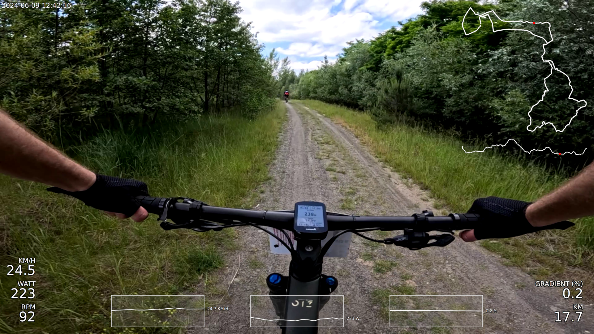
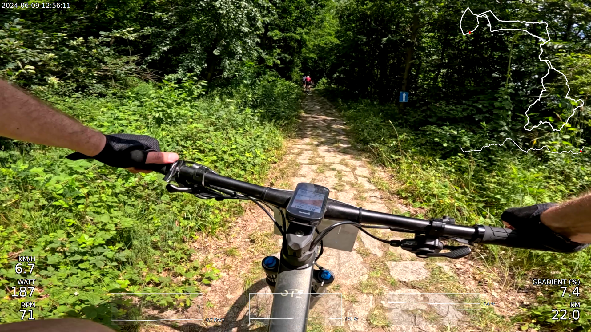

# Videographer

[](https://github.com/neri14/videographer/actions/workflows/build-and-test.yml)

This project is licensed under the terms of the [MIT license](./LICENSE).

Videographer is an application allowing creation of overlay telemetry data onto sport videos.

At the moment it supports .fit files generated by Garmin devices.

Videographer was tested on GoPro Hero 12 videos and Garmin Edge 830 produced .fit files.

For best results use instructions below how to build a project, to satisfy dependencies I recommend checking [GitHub actions](./.github/workflows/build-and-test.yml) setup.

## Examples

Example screenshots from test video: [YouTube - NeriMTB](https://youtu.be/lMlHlpprMGI)





## Building and testing

1. ```cmake -B build``` generate cmake files to build directory
1. ```cmake --build build --target vgraph``` build main binary
1. ```build/vgraph -h``` see usage arguments
1. ```cmake --build build --target vgraph_test``` build unit tests
1. ```build/vgraph_test``` run unit tests


## Pipeline

1. Gather video clips (.mp4) and telemetry file (.fit) to be used

1. Concatenate video clips

   example ffmpeg command: ```ffmpeg -f concat -safe 0 -i mylist.txt -c copy output.mp4```

   with ```mylist.txt``` content:
   ```
   file '/path/to/clip/1.mp4'
   file '/path/to/clip/2.mp4'
   file '/path/to/clip/3.mp4'
   ```

1. Trim concatenated video

   example ffmpeg command: ```ffmpeg -ss 00:00:30.0 -to 00:01:00.0 -i input.mp4 -c copy output.mp4```

1. Run generator in alignment mode (see instructions below) to determine telemetry offset

1. Run generator app to generate final video

   > for YT - use upscale to 4K and 80mbit/s bitrate (```-r 3840x2160 -b 80000```)

1. Upload video


## Dependencies

**TBD** - partial dependencies below

Packages required in system to build the application

- CMake >= 3.23
- Make / Ninja
- GCC >= 14.x
- gstreamer >= 1.24
- cairo
- pango
- pugixml

For testing

- googlemock

## Alignment Mode

Basic usage based on speed visible on video:

1. run generator with ```--alignment``` to generate alignment clip (can also use ```--clip-time``` to change default 60s duration of alignment clip)
1. open video in your favorite video player and find exact frame at which speed changes
1. locate data frame with same speed change in alignment data and remember the ```OFFSET```
1. use that ```OFFSET``` as input for main application to align the overlay
